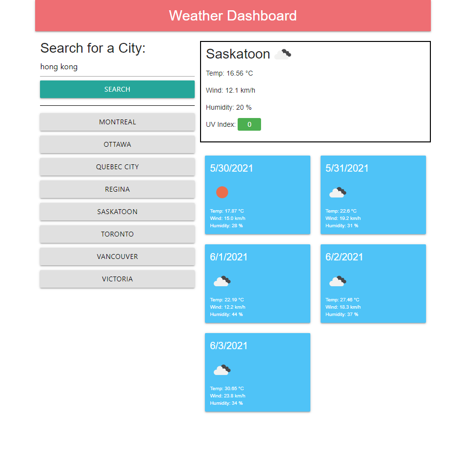

# WEATHER DASHBOARD 
## Description
U of T Full Stack Developer Bootcamp Challenge 6. A weather dashboard using a weather server-side API. Also uses Materialize UI for styling. This application can show you the next 5 days forecast for any city you search for.

## Table of Contents

- [Usage](#Usage)
- [Contribute](#Contribute)
- [Tests](#Tests)
- [Questions](#Questions)
- [Code-of-Conduct](#Code-of-Conduct)
- [License](#License)

## Usage
This application is simple to use. All you need to do is type in the name of a city in the search bar and hit the search button. You need access to an internet connection in order for it to then display the current weather and the next five days' forecast. You can even select previously-searched cities from the search bar, or click on a list of major Canadian cities below the search bar. It should format nicely on screens small and large, usable by all.

## Contribute
If you wish to contribute to this application's development, here are a few ways you can do so:
-Submit bugs and feature requests

What cities should be displayed beneath the search bar for quick use? Let me know!

## Tests
There are so many cities with similar or identical names that could confuse the simple search system. When checking functionality, always be aware that the results you get may be skewed by cultural, linguistic or syntactic misunderstanding in that regard.

## Questions
If you need to reach me, my GitHub username (and a link to my profile page) is [RookiePrime](https://github.com/RookiePrime) and my email address is [kiefer_8@hotmail.com](mailto:kiefer_8@hotmail.com).

### Frequently Asked Questions
#### Why doesn't it show my city, town or settlement?
Perhaps the One Call API doesn't include the desired location, or maybe not under the search term you expected. Try adding a comma and an abbreviation for the name of the state, province, territory or country next to it, to clarify the search.
#### Can it show more information?
If further developed, it absolutely could. If I receive requests to expand this application, I could see adding hourly updates, a full 7 day week of forecast data, and more.

## Code-of-Conduct
### Contributor Covenant
We as members, contributors, and leaders pledge to make participation in our
community a harassment-free experience for everyone, regardless of age, body
size, visible or invisible disability, ethnicity, sex characteristics, gender
identity and expression, level of experience, education, socio-economic status,
nationality, personal appearance, race, caste, color, religion, or sexual identity
and orientation.

We pledge to act and interact in ways that contribute to an open, welcoming,
diverse, inclusive, and healthy community.
[Click here to read the full code of conduct](https://www.contributor-covenant.org/version/2/0/code_of_conduct/)

## License
This software is offered under the MIT License. For more information on conditions of use, [follow this link.](https://opensource.org/licenses/MIT).

[Link to the live page](https://rookieprime.github.io/weather-dashboard/)

[Link to the repository](https://github.com/RookiePrime/weather-dashboard)